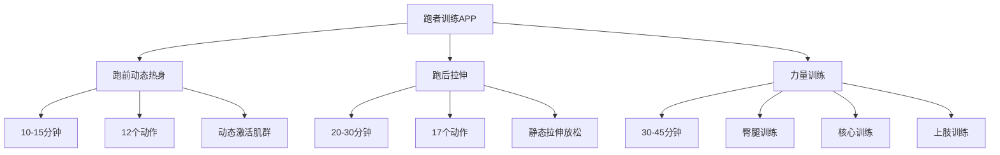

# 跑者训练APP - 完整设计方案

## 1. 产品概述

### 产品定位
个人使用的专业跑者训练工具，专注于跑前热身、跑后拉伸和专项力量训练，替代Keep/咕咚等付费功能，提供免费、无广告的专属训练体验。

### 核心价值
- 科学的训练计划：基于跑步运动生理学设计的动作组合
- 简洁的用户体验：无冗余功能，专注训练流程
- 离线可用：所有内容本地存储，无需网络连接
- 专业指导：动作视频+语音提示+倒计时系统

### 目标用户
- 马拉松/越野跑爱好者
- 健身跑人群
- 希望提升跑步表现和预防 injury 的跑者

## 2. 功能架构图



## 3. 信息架构

### 页面层级结构图

```
跑者训练APP
├── 首页/训练选择页 (Level 1)
│   ├── 跑前热身模块卡片
│   ├── 跑后拉伸模块卡片  
│   └── 力量训练模块卡片
├── 训练详情页 (Level 2)
│   ├── 训练信息
│   ├── 动作列表预览
│   └── 开始训练按钮
├── 动作执行页 (Level 3)
│   ├── 动作视频
│   ├── 倒计时系统
│   ├── 动作信息
│   └── 控制按钮
├── 休息过渡页 (Level 3)
│   ├── 休息倒计时
│   └── 下一个动作预览
├── 训练完成页 (Level 3)
│   ├── 训练统计
│   └── 返回首页按钮
├── 历史记录页 (Level 2)
│   ├── 训练记录列表
│   └── 统计图表
└── 设置页 (Level 2)
    ├── 音频设置（音量、语音、音效）
    ├── 训练设置（时长、休息）
    └── 显示设置（主题）
```

### 导航逻辑

1. **主流程导航**：首页 → 训练详情页 → 动作执行页 → 休息过渡页 → 训练完成页
2. **全局导航**：所有页面均有返回按钮，可返回上一级
3. **快捷操作**：动作执行页支持手势操作（暂停、静音、切换动作）
4. **状态保持**：训练过程中意外退出，重新进入时可恢复训练

## 4. 核心页面设计

### 4.1 首页/训练选择页

**布局结构**：
- 顶部：应用标题 + 用户头像
- 中间：三大训练模块卡片（跑前热身、跑后拉伸、力量训练）
- 底部：历史记录入口 + 设置按钮

**核心组件**：
- 训练模块卡片：包含模块名称、训练时长、动作数量、预览图片
- 统计卡片：显示本周训练次数、总时长等数据
- 操作按钮：开始训练按钮、历史记录按钮、设置按钮

**交互逻辑**：
- 点击模块卡片 → 进入训练详情页
- 点击历史记录按钮 → 进入历史记录页
- 点击设置按钮 → 进入设置页面（音量、通知、主题等）

**视觉优先级**：
- 模块卡片：高（占80%屏幕空间）
- 统计信息：中（顶部小区域）
- 底部操作：中（固定底部导航）

### 4.2 训练详情页

**布局结构**：
- 顶部：训练标题 + 返回按钮
- 中间：训练信息（时长、动作数量、难度等级）
- 下方：动作列表预览
- 底部：开始训练按钮

**核心组件**：
- 训练信息卡片：展示训练概要
- 动作列表：显示每个动作的名称、时长、目标肌群
- 难度标签：初级/中级/高级标签
- 开始按钮：突出显示的CTA按钮

**交互逻辑**：
- 点击返回 → 回到首页
- 点击开始训练 → 进入动作执行页
- 点击动作列表项 → 可查看动作详情（可选）

**视觉优先级**：
- 训练信息和开始按钮：高
- 动作列表：中
- 返回按钮：低

### 4.3 动作执行页

**布局结构**：
- 顶部：动作标题 + 进度条
- 中间：动作视频/动画展示区
- 下方：倒计时系统 + 动作描述
- 底部：控制按钮

**核心组件**：
- 视频播放器：全屏播放动作演示
- 倒计时器：显示剩余时间
- 进度指示器：显示当前动作在训练中的位置
- 控制按钮：暂停/继续、上一个/下一个、静音
- 动作信息：动作名称、目标肌群

**交互逻辑**：
- 点击视频区域 → 暂停/继续
- 左右滑动 → 上一个/下一个动作
- 双击 → 静音/取消静音
- 长按 → 退出训练

**视觉优先级**：
- 视频区域和倒计时器：高（占60%屏幕空间）
- 控制按钮：中（固定底部）
- 动作信息：低（顶部和底部）

### 4.4 休息过渡页

**布局结构**：
- 顶部：休息标题
- 中间：休息倒计时
- 下方：下一个动作预览
- 底部：控制按钮

**核心组件**：
- 休息倒计时器：大字体显示剩余休息时间
- 下一个动作信息：动作名称、预览图片
- 控制按钮：跳过休息、暂停/继续

**交互逻辑**：
- 点击跳过休息 → 直接进入下一个动作
- 倒计时结束 → 自动进入下一个动作

**视觉优先级**：
- 休息倒计时：高
- 下一个动作预览：中
- 控制按钮：低

### 4.5 训练完成页

**布局结构**：
- 顶部：训练完成动画
- 中间：训练统计数据
- 底部：返回首页按钮

**核心组件**：
- 完成动画：成功图标或烟花效果
- 训练统计：总时长、动作完成数、消耗卡路里
- 操作按钮：查看历史记录、返回首页

**交互逻辑**：
- 点击返回首页 → 回到首页
- 训练记录自动保存到本地

**视觉优先级**：
- 完成动画和训练统计：高
- 操作按钮：中

### 4.6 历史记录页

**布局结构**：
- 顶部：统计图表（每周训练次数、总时长）
- 中间：训练记录列表
- 底部：筛选和搜索功能

**核心组件**：
- 统计图表：柱状图、折线图
- 训练记录卡片：包含训练类型、日期、时长、动作数
- 筛选器：按训练类型、日期范围筛选
- 搜索栏：搜索训练记录

**交互逻辑**：
- 点击记录卡片 → 查看训练详情
- 筛选/搜索 → 过滤记录列表
- 长按记录 → 删除

**视觉优先级**：
- 统计图表：高（顶部展示）
- 训练记录列表：中
- 筛选和搜索：低（底部或顶部）

### 4.7 设置页

**布局结构**：
- 顶部：设置标题 + 返回按钮
- 中间：设置选项分组列表

**核心组件**：
- 音频设置组：
  - 音量大小滑块（0-100%）
  - 语音提示开关
  - 音效开关（滴答声、完成提示音）
- 训练设置组：
  - 默认动作时长选择（30s/45s/60s）
  - 休息时长选择（5s/10s/15s）
- 显示设置组：
  - 深色/浅色模式切换
  - 自动跟随系统（默认）
- 其他设置：
  - 屏幕常亮开关

**交互逻辑**：
- 点击返回 → 回到首页
- 各设置项实时保存到 Hive
- 音量滑块拖动时实时反馈

**视觉优先级**：
- 设置分组标题：中
- 设置项列表：高

## 5. 交互设计规范

### 5.1 倒计时系统

```javascript
// 倒计时逻辑
class CountdownTimer {
  constructor(duration, callback) {
    this.duration = duration;
    this.callback = callback;
    this.remaining = duration;
  }
  
  start() {
    this.timer = setInterval(() => {
      this.remaining--;
      this.callback(this.remaining);
      
      // 最后5秒语音提示
      if (this.remaining <= 5 && this.remaining > 0) {
        VoicePlayer.play(`倒计时 ${this.remaining} 秒`);
      }
      
      if (this.remaining <= 0) {
        this.stop();
        this.callback(0);
      }
    }, 1000);
  }
  
  stop() {
    clearInterval(this.timer);
  }
}
```

**规范**：
- 每秒显示剩余时间
- 最后5秒每秒语音提示
- 时间结束时有明显的音效
- 支持暂停/继续功能

### 5.2 手势操作

| 手势 | 功能 | 反馈 |
|------|------|------|
| 点击视频区域 | 暂停/继续 | 暂停时显示暂停图标，继续时隐藏 |
| 左右滑动 | 切换动作 | 滑动时显示下一个/上一个动作预览 |
| 双击视频区域 | 静音/取消静音 | 静音时显示静音图标，取消时隐藏 |
| 长按屏幕 | 显示菜单 | 显示退出训练、调整音量等选项 |

### 5.3 音频反馈规范

**语音提示**：
- 动作开始："准备，开始"
- 动作结束："动作完成"
- 休息开始："休息一下"
- 休息结束："休息时间到"
- 训练完成："训练完成，恭喜你"

**音效**：
- 倒计时滴答声（每秒一次）
- 动作开始/结束提示音
- 错误操作提示音（短蜂鸣）

**音量控制**：
- 独立的应用音量控制
- 支持系统音量调节
- 支持静音功能（手势+按钮）

### 5.4 视频播放控制

**播放方式**：
- 自动播放：进入动作执行页自动播放
- 循环播放：动作期间重复播放
- 全屏播放：双击或点击全屏按钮
- 暂停/继续：点击视频区域或控制按钮

**视频质量**：
- 分辨率：720p（平衡质量和文件大小）
- 格式：MP4（广泛支持）
- 码率：2Mbps（保证流畅播放）

## 6. 视觉设计系统

### 6.1 色彩系统

**主色**：
- 跑前热身：蓝色系 (#4A90E2) - 代表活力、清新
- 跑后拉伸：绿色系 (#50E3C2) - 代表放松、恢复
- 力量训练：橙色系 (#F5A623) - 代表力量、能量

**功能色**：
- 成功：绿色 (#7ED321)
- 警告：黄色 (#F8E71C)
- 错误：红色 (#D0021B)
- 信息：蓝色 (#4A90E2)

**中性色**：
- 背景：#FFFFFF（亮）/ #1A1A1A（暗）
- 卡片：#F8F9FA（亮）/ #2C2C2C（暗）
- 边框：#E8E8E8（亮）/ #3D3D3D（暗）
- 文字：#333333（亮）/ #FFFFFF（暗）

### 6.2 字体层级

| 层级 | 字体大小 | 字重 | 行高 | 用途 |
|------|----------|------|------|------|
| H1 | 24px | 700 | 32px | 页面标题 |
| H2 | 20px | 600 | 28px | 模块标题 |
| H3 | 18px | 600 | 24px | 卡片标题 |
| Body1 | 16px | 400 | 24px | 主要正文 |
| Body2 | 14px | 400 | 20px | 辅助文字 |
| Caption | 12px | 400 | 16px | 小提示文字 |

### 6.3 间距系统

| 间距 | 数值 | 用途 |
|------|------|------|
| XS | 4px | 组件内部间距 |
| S | 8px | 元素间距 |
| M | 16px | 卡片间距 |
| L | 24px | 页面区块间距 |
| XL | 32px | 页面四周间距 |

### 6.4 圆角/阴影规范

**圆角**：
- 小元素：4px（按钮、输入框）
- 卡片：8px（模块卡片、训练记录）
- 大组件：12px（弹窗、对话框）

**阴影**：
- 卡片阴影：0 2px 8px rgba(0,0,0,0.1)（亮）/ 0 2px 8px rgba(0,0,0,0.3)（暗）
- 悬浮阴影：0 4px 16px rgba(0,0,0,0.15)（亮）/ 0 4px 16px rgba(0,0,0,0.4)（暗）
- 按钮阴影：0 2px 4px rgba(0,0,0,0.1)（亮）/ 0 2px 4px rgba(0,0,0,0.3)（暗）

### 6.5 暗色/亮色模式支持

**切换方式**：
- 自动跟随系统设置
- 支持手动切换（设置页面）

**适配原则**：
- 确保在两种模式下都有良好的对比度
- 保持功能区域的视觉一致性
- 动画效果在两种模式下都能正常显示

## 7. 技术实现要点

### 7.1 状态管理方案

使用 Riverpod 作为状态管理工具：

```dart
// 训练状态管理
final workoutStateProvider = StateNotifierProvider<WorkoutStateNotifier, WorkoutState>((ref) {
  return WorkoutStateNotifier();
});

class WorkoutStateNotifier extends StateNotifier<WorkoutState> {
  WorkoutStateNotifier() : super(const WorkoutState());
  
  // 训练控制方法
  void startWorkout(Workout workout) {
    state = state.copyWith(
      currentWorkout: workout,
      status: WorkoutStatus.inProgress,
      currentExerciseIndex: 0,
    );
  }
  
  void pauseWorkout() {
    state = state.copyWith(status: WorkoutStatus.paused);
  }
  
  void resumeWorkout() {
    state = state.copyWith(status: WorkoutStatus.inProgress);
  }
  
  void nextExercise() {
    if (state.currentExerciseIndex < state.currentWorkout.exercises.length - 1) {
      state = state.copyWith(
        currentExerciseIndex: state.currentExerciseIndex + 1,
        status: WorkoutStatus.resting,
      );
    } else {
      state = state.copyWith(status: WorkoutStatus.completed);
    }
  }
}
```

### 7.2 音视频播放方案

**音频播放**：使用 `audioplayers` 库
- 支持本地音频文件播放
- 支持后台播放
- 支持音量控制和静音

**视频播放**：使用 `video_player` 库
- 支持本地视频文件播放
- 支持全屏播放
- 支持循环播放和自动播放

### 7.3 本地存储方案

使用 `hive` 作为本地存储：
- 轻量级 NoSQL 数据库
- 快速读写
- 支持加密
- 无需后台服务

**存储内容**：
- 训练记录：WorkoutSession
- 动作执行记录：ExerciseRecord
- 用户设置：音量、主题、通知等
- 训练进度：当前训练状态

### 7.4 后台音频播放

**MVP阶段**：
- 使用 `audioplayers` 的后台模式支持锁屏后继续播放语音提示
- 配置 Android 后台音频权限（AndroidManifest.xml）
- 训练期间保持前台运行，不依赖完整的后台服务

**后续版本可选**：
- 如需完整后台训练功能，可引入 `flutter_background_service`

### 7.5 屏幕常亮

使用 `wakelock_plus` 插件（替代已deprecated的wakelock）：
- 训练过程中保持屏幕常亮
- 训练完成后恢复系统默认设置
- 支持手动控制（设置页面）

## 8. 数据模型

### 8.1 Workout（训练计划）

```dart
class Workout {
  final String id;
  final String name;
  final String type; // warmup | stretch | strength
  final int duration; // 总时长（秒）
  final List<Exercise> exercises;
  final String difficulty; // beginner | intermediate | advanced
  final String description;

  Workout({
    required this.id,
    required this.name,
    required this.type,
    required this.duration,
    required this.exercises,
    required this.difficulty,
    required this.description,
  });
}
```

### 8.2 Exercise（单个动作）

```dart
class Exercise {
  final String id;
  final String name;
  final int duration; // 动作持续时间（秒）
  final int restDuration; // 休息时间（秒）
  final String targetMuscles; // 目标肌群
  final String description; // 动作描述
  final String videoPath; // 本地视频路径
  final String imagePath; // 预览图片路径
  final String difficulty; // 难度等级

  Exercise({
    required this.id,
    required this.name,
    required this.duration,
    required this.restDuration,
    required this.targetMuscles,
    required this.description,
    required this.videoPath,
    required this.imagePath,
    required this.difficulty,
  });
}
```

### 8.3 WorkoutSession（训练记录）

```dart
class WorkoutSession {
  final String id;
  final String workoutId;
  final String workoutName;
  final String workoutType;
  final DateTime startTime;
  final DateTime? endTime;
  final DateTime? pausedAt;           // 暂停时间点（用于恢复训练）
  final int currentExerciseIndex;     // 当前动作索引（用于恢复）
  final int duration;                 // 实际训练时长（秒）
  final int completedExercises;       // 完成的动作数
  final List<ExerciseRecord> exerciseRecords;
  final String status;                // completed | interrupted | paused

  WorkoutSession({
    required this.id,
    required this.workoutId,
    required this.workoutName,
    required this.workoutType,
    required this.startTime,
    this.endTime,
    this.pausedAt,
    this.currentExerciseIndex = 0,
    required this.duration,
    required this.completedExercises,
    required this.exerciseRecords,
    required this.status,
  });
}
```

### 8.4 UserProfile（用户信息）

```dart
class UserProfile {
  final String id;
  final String name;                  // 用户昵称
  final DateTime createdAt;           // 创建时间
  final int totalWorkouts;            // 总训练次数
  final int totalMinutes;             // 总训练时长（分钟）
  final String preferredDifficulty;   // 默认难度偏好：beginner/intermediate/advanced
  final int defaultExerciseDuration;  // 默认动作时长（秒，如45/60）
  final int defaultRestDuration;      // 默认休息时长（秒，如5/10）
  final bool soundEnabled;            // 音效开关
  final bool voiceEnabled;            // 语音提示开关
  final double volume;                // 音量（0.0-1.0）
  final bool keepScreenOn;            // 屏幕常亮开关

  UserProfile({
    required this.id,
    required this.name,
    required this.createdAt,
    this.totalWorkouts = 0,
    this.totalMinutes = 0,
    this.preferredDifficulty = 'beginner',
    this.defaultExerciseDuration = 60,
    this.defaultRestDuration = 5,
    this.soundEnabled = true,
    this.voiceEnabled = true,
    this.volume = 0.8,
    this.keepScreenOn = true,
  });
}
```

### 8.5 ExerciseRecord（单动作执行记录）

```dart
class ExerciseRecord {
  final String id;
  final String exerciseId;
  final String exerciseName;
  final int duration; // 实际执行时间（秒）
  final int restDuration; // 实际休息时间（秒）
  final DateTime startTime;
  final DateTime endTime;
  final String status; // completed | skipped

  ExerciseRecord({
    required this.id,
    required this.exerciseId,
    required this.exerciseName,
    required this.duration,
    required this.restDuration,
    required this.startTime,
    required this.endTime,
    required this.status,
  });
}
```

## 9. 动作内容规范

### 9.1 跑前动态热身 (10-15分钟, 12个动作)

| 动作名称 | 持续时间 | 目标肌群 | 难度 | 动作描述要点 |
|---------|----------|----------|------|-------------|
| 高抬腿 | 60秒 | 大腿前侧 | 初级 | 保持上半身正直，快速交替抬腿至髋部高度 |
| 开合跳 | 60秒 | 全身 | 初级 | 双脚跳跃分开，手臂向上摆动；跳跃收回，手臂放下 |
| 箭步蹲跳 | 60秒 | 大腿前侧/后侧 | 中级 | 箭步蹲姿势，向上跳起并交换双腿 |
| 后踢腿跑 | 60秒 | 大腿后侧 | 初级 | 向后踢腿，尽量让脚跟触碰臀部 |
| 侧滑步 | 60秒 | 大腿内侧/外侧 | 初级 | 左右侧滑步，保持低重心 |
| 臀桥 | 60秒 | 臀部/大腿后侧 | 初级 | 仰卧，屈膝，抬起臀部至身体成直线 |
| 猫牛式 | 60秒 | 脊柱 | 初级 | 跪姿，吸气拱背，呼气塌腰 |
| 躯干旋转 | 60秒 | 腹部/背部 | 初级 | 站立，双手交叉，向两侧旋转躯干 |
| 手腕/脚踝旋转 | 60秒 | 手腕/脚踝 | 初级 | 分别旋转手腕和脚踝，顺时针/逆时针 |
| 腿部摆动 | 60秒 | 大腿内侧/外侧 | 初级 | 站立，一只脚支撑，另一只脚向两侧摆动 |
| 肩部环绕 | 60秒 | 肩部 | 初级 | 手臂自然下垂，向前/向后环绕肩部 |
| 原地慢跑 | 60秒 | 全身 | 初级 | 原地慢跑，保持中等速度 |

### 9.2 跑后拉伸 (20-30分钟, 17个动作)

| 动作名称 | 持续时间 | 目标肌群 | 难度 | 动作描述要点 |
|---------|----------|----------|------|-------------|
| 股四头肌拉伸 | 60秒/腿 | 大腿前侧 | 初级 | 站立，手扶墙壁，向后屈膝，脚跟触碰臀部 |
| 腘绳肌拉伸 | 60秒/腿 | 大腿后侧 | 初级 | 坐在地上，一条腿伸直，另一条腿弯曲，身体向前倾 |
| 小腿拉伸 | 60秒/腿 | 小腿 | 初级 | 面对墙壁，前腿弯曲，后腿伸直，脚跟贴地 |
| 臀部拉伸 | 60秒/腿 | 臀部 | 初级 | 仰卧，屈膝，一条腿交叉在另一条腿上，抱住膝盖向胸部拉近 |
| 内收肌拉伸 | 60秒 | 大腿内侧 | 初级 | 坐在地上，双脚掌相对，膝盖向外打开，身体向前倾 |
| 梨状肌拉伸 | 60秒/腿 | 臀部/外旋肌 | 中级 | 仰卧，一条腿屈膝，另一条腿搭在上面，抱住膝盖向胸部拉近 |
| 背部拉伸 | 60秒 | 背部 | 初级 | 坐在地上，双腿伸直，身体向前倾，手臂向前伸展 |
| 胸部拉伸 | 60秒 | 胸部 | 初级 | 站立，双手在身后交叉，抬起手臂，胸部向前挺 |
| 肩部拉伸 | 60秒/臂 | 肩部 | 初级 | 一条手臂横过胸部，另一只手轻轻按压肘部 |
| 三头肌拉伸 | 60秒/臂 | 三头肌 | 初级 | 一条手臂向上伸直，弯曲肘部，另一只手按压肘部 |
| 手腕拉伸 | 60秒/腕 | 手腕 | 初级 | 手臂伸直，手指向下，另一只手轻轻拉伸手指 |
| 脚踝拉伸 | 60秒/踝 | 脚踝 | 初级 | 坐在地上，一条腿伸直，另一条腿弯曲，用手拉伸脚趾 |
| 脊柱扭转 | 60秒/侧 | 脊柱 | 初级 | 坐在地上，一条腿弯曲，另一条腿跨过膝盖，身体向一侧扭转 |
| 婴儿式 | 60秒 | 背部/臀部 | 初级 | 跪姿，臀部坐在脚跟上，身体向前倾，手臂伸展 |
| 下犬式 | 60秒 | 背部/腿部 | 中级 | 双手支撑，身体成倒V形，脚跟尽量贴地 |
| 冥想放松 | 300秒 | 全身 | 初级 | 坐姿或仰卧，深呼吸，放松全身肌肉 |

### 9.3 力量训练 (30-45分钟, 臀腿+核心+上肢)

#### 9.3.1 臀腿训练 (15分钟, 8个动作)

| 动作名称 | 持续时间 | 目标肌群 | 动作描述要点 |
|---------|----------|----------|-------------|
| 深蹲 | 60秒 | 臀部/大腿前侧 | 双脚与肩同宽，膝盖弯曲，身体向下蹲 |
| 硬拉 | 60秒 | 臀部/大腿后侧 | 站立，手持重物，向前弯腰，背部挺直 |
| 箭步蹲 | 60秒/腿 | 大腿前侧/后侧 | 向前跨一步，膝盖弯曲，身体向下蹲 |
| 臀推 | 60秒 | 臀部 | 坐在地上，背部靠在稳定物体上，向上推臀部 |
| 单腿硬拉 | 60秒/腿 | 臀部/大腿后侧 | 单腿站立，向前弯腰，另一条腿向后抬起 |
| 提踵 | 60秒 | 小腿 | 双脚站立，踮起脚尖，保持几秒钟后放下 |
| 侧蹲 | 60秒/腿 | 大腿内侧/外侧 | 向一侧跨步，膝盖弯曲，身体向下蹲 |
| 腿举 | 60秒 | 大腿前侧 | 仰卧，屈膝，向上推双腿至伸直 |

#### 9.3.2 核心训练 (12分钟, 6个动作)

| 动作名称 | 持续时间 | 目标肌群 | 动作描述要点 |
|---------|----------|----------|-------------|
| 平板支撑 | 60秒 | 核心肌群 | 双手支撑，身体成直线，保持几秒钟 |
| 侧平板支撑 | 60秒/侧 | 侧腹肌 | 单臂支撑，身体成直线，保持几秒钟 |
| 卷腹 | 60秒 | 上腹肌 | 仰卧，屈膝，抬起上半身至与地面成45度 |
| 仰卧起坐 | 60秒 | 上腹肌/髋屈肌 | 仰卧，屈膝，坐起至身体与地面成90度 |
| 俄罗斯转体 | 60秒 | 侧腹肌 | 仰卧，屈膝，抬起上半身，向两侧扭转 |
| 鸟狗式 | 60秒 | 背部/核心 | 跪姿，交替伸出对侧手臂和腿 |

#### 9.3.3 上肢训练 (10分钟, 6个动作)

| 动作名称 | 持续时间 | 目标肌群 | 动作描述要点 |
|---------|----------|----------|-------------|
| 俯卧撑 | 60秒 | 胸部/三头肌 | 双手支撑，身体成直线，弯曲肘部向下 |
| 引体向上 | 60秒 | 背部/二头肌 | 悬挂在单杠上，向上拉身体至下巴过杠 |
| 哑铃卧推 | 60秒 | 胸部/三头肌 | 仰卧，手持哑铃，向上推至手臂伸直 |
| 哑铃划船 | 60秒/臂 | 背部/二头肌 | 单腿支撑，向前弯腰，手持哑铃向上拉 |
| 哑铃肩推 | 60秒 | 肩部/三头肌 | 站立，手持哑铃，向上推至手臂伸直 |
| 弯举 | 60秒/臂 | 二头肌 | 站立，手持哑铃，向上弯曲肘部 |

## 10. 开发里程碑

### 10.1 MVP版本（核心训练流程） - 预计2周

**功能范围**：
- 首页/训练选择页（跑前热身模块）
- 训练详情页（跑前热身动作列表）
- 动作执行页（基本训练功能）
- 休息过渡页
- 训练完成页
- 本地存储（训练记录）

**技术实现**：
- Riverpod 状态管理
- 基础音视频播放
- 简单的本地存储
- 屏幕常亮
- 基础手势操作

**测试重点**：
- 训练流程的完整性
- 音视频播放的稳定性
- 手势操作的响应性
- 设备兼容性

### 10.2 完整版（三大模块+历史记录） - 预计4周

**新增功能**：
- 跑后拉伸模块
- 力量训练模块
- 历史记录页（训练记录列表）
- 统计图表（每周训练次数、总时长）
- 筛选和搜索功能

**技术优化**：
- 后台运行保活
- 数据加密
- 优化的视频加载和播放
- 更完善的错误处理

**测试重点**：
- 三大模块的训练流程
- 历史记录的查询和显示
- 统计数据的准确性
- 性能优化（内存、CPU使用）

### 10.3 优化版（高级功能） - 预计6周

**新增功能**：
- 个性化训练计划（周计划/月计划）
- 训练提醒功能
- 详细的统计分析（趋势图表）
- 难度分级筛选

**技术改进**：
- 性能进一步优化
- 动作视频云端加载（可选）

**测试重点**：
- 用户体验的流畅性
- 高级功能的稳定性

---

## 11. 部署计划

### 11.1 Android 平台

**分发渠道**：
- Google Play Store
- 第三方应用商店（小米、华为、OPPO、VIVO等）
- 官网下载（APK文件）

**发布要求**：
- 应用签名
- 权限声明
- 应用描述和截图
- 测试报告

### 11.2 iOS 平台

**分发渠道**：
- App Store

**发布要求**：
- Apple Developer 账户
- 应用签名
- App Store Connect 配置
- 应用截图和描述
- 测试报告（TestFlight）

## 12. 维护计划

**更新频率**：
- 功能更新：每季度一次
- 错误修复：每月一次
- 安全更新：及时更新

**用户反馈处理**：
- 建立反馈渠道（邮件、应用内反馈）
- 定期分析用户反馈
- 优先处理高优先级问题

**性能监控**：
- 集成崩溃报告工具（Firebase Crashlytics）
- 定期分析应用性能（内存、CPU使用）
- 优化应用启动时间和响应时间

---

## 附录

### A. 资源清单

**图片资源**：
- 应用图标
- 模块卡片背景图
- 动作预览图
- 统计图表

**音频资源**：
- 语音提示
- 音效（滴答声、提示音）

**视频资源**：
- 动作演示视频
- 应用介绍视频

**文字资源**：
- 应用界面文字
- 动作描述
- 用户指导
- 帮助文档

### B. 工具和依赖

**开发工具**：
- Flutter SDK
- Android Studio/Visual Studio Code
- 模拟器/真机

**第三方库**：
- `riverpod`：状态管理
- `hive`：本地存储
- `audioplayers`：音频播放
- `video_player`：视频播放
- `wakelock_plus`：屏幕常亮（替代已deprecated的wakelock）
- `shared_preferences`：用户设置
- `flutter_launcher_icons`：应用图标

---

本设计方案完整详细，覆盖了从产品定位到技术实现的各个方面，开发者可直接按照此文档进行开发。方案注重用户体验和技术可行性的平衡，确保应用的稳定性和可扩展性。